# A sevillai Real Alcázar

## Tanulói munkafüzet – felnőttoktatás

> **Magyar nyelvű változat az eredeti angol nyelvű PDF alapján.**
>
> Az eredeti kiadvány képei, térképei és rajzos feladatai helyén jelölést alkalmaztam, mivel ezek nem alakíthatók át teljes értékűen Markdown-szöveggé.

---

## 1. oldal – Címoldal

# A sevillai Real Alcázar

**Tanulói munkafüzet**  
**Felnőttoktatás**

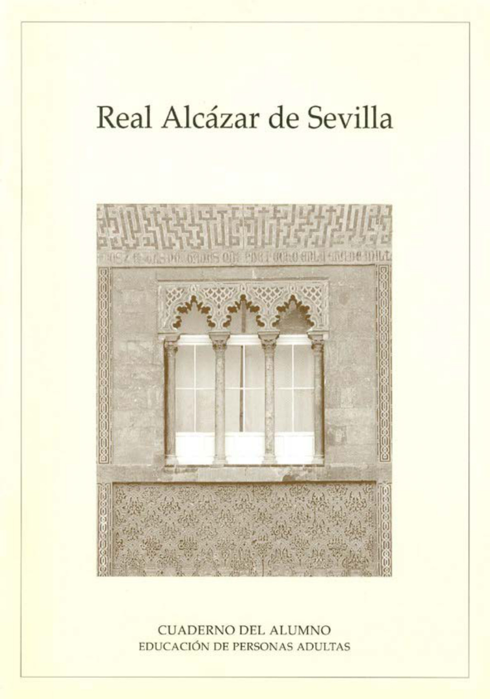

---

## 2. oldal – A kiadvány adatai

### Szerzők

- Ana Ávila Álvarez
- Isabel García Martín
- Maribel Hidalgo Estévez
- Esperanza Nunes Léiper
- Pedro Respaldiza Lama

### Grafikai tervezés

Francisco Salado Fernández

### Tördelés

- Manuela González Moreno
- Francisco Salado Fernández

### Fényképek

- J. Alberto Marín Serrano
- Rafael Rodríguez Román
- Toño San Román Oregui

### Szakmai tanácsadás

Bellas Artes Pedagógiai Iroda

### Kiadási adatok

A munkafüzet az Andalúziai Oktatási Tanács és az El Monte Alapítvány közötti együttműködés keretében készült.

**ISBN:** 84-8051-811-1  
**Jogi letéti szám:** SE-1.826-1997

**Nyomtatás:** Impr. A. Pinelo, Camas – Sevilla

A szerzők köszönetet mondanak a sevillai Real Alcázar Patronátusának az együttműködésért.

---

## 3. oldal – A látogatás előkészítése

A sevillai Real Alcázar műemlékegyüttese a város egyik legjelentősebb épületegyüttese, mind művészeti értéke, mind több mint ezeréves története miatt. Ezért tanulmányozása és meglátogatása pedagógiai szempontból is különösen érdekes.

Az emlékmű nagy kiterjedése és összetettsége miatt gondosan kell kiválasztani a meglátogatandó elemeket és a tanulmányozandó tartalmakat, hogy elkerüljük a tájékozatlanságot és a zavart.

Ezért alapvetően az együttes egy meghatározott részére összpontosítunk: **I. (Kegyetlen) Péter mudejár palotájára**, valamint egy meghatározott korszakra: a **14. századra**. Ugyanakkor egyszerűsített formában arra törekszünk, hogy általános képet kapjunk az egész együttesről, mind fizikai, mind történelmi szempontból.

**A sevillai Real Alcázar látogatásának előkészítése**

---

# 4. oldal – I. Péter uralkodása

## I. Péter uralkodása

I. Péter, XI. Alfonz és Portugáliai Mária egyetlen törvényes fia, **1350-ben**, tizenöt éves korában lépett trónra.

A krónikák szerint:

> „Magas termetű, fehér bőrű és szőke volt, beszéd közben kissé selypített… Madárvadász volt, jól tűrte a megpróbáltatásokat, mértékletes volt, jól szokott étkezni és inni; keveset aludt és sok nőt szeretett. Nagyon szorgalmas volt a háborúkban, és mohón gyűjtötte a kincseket és ékszereket.”

Uralkodása kezdetétől meg kellett erősítenie tekintélyét a nemesekkel, aragóniai unokatestvéreivel – akiknek öröklési jogaik voltak –, valamint különösen apja törvénytelen fiaival szemben. Ezek XI. Alfonz és szeretője, Guzmáni Eleonóra gyermekei voltak. Guzmáni Eleonórát Portugáliai Mária fia, a király nevében megölette.

I. Péter tanácsadói és saját anyja nyomást gyakoroltak rá, hogy házasodjon meg és biztosítsa az utódlást. Házasságát **Bourbon Blankával**, Franciaország királyának unokahúgával rendezték el, akit a forrás „szőke, fehér bőrű, elegáns és intelligens” nőként ír le.

Hozományát 300 000 aranyforintban állapították meg, amelyet végül nem fizettek ki; ez részben magyarázhatta a király Blanka iránti magatartását.

A krónikák szerint a házasság előtt:

> „a király nagyon beleszeretett María de Padillába, olyannyira, hogy már nem akart feleségül menni Blankához, mert María nagyon szép, okos és alacsony termetű volt.”

Mindezek ellenére a király akaratán kívül Valladolidban feleségül vette Bourbon Blankát, akit három nap múlva elhagyott, és kedvencéhez, María de Padillához tért vissza.

María de Padilla, Portugáliai Mária és Eleonóra, Aragóniai Infánsok anyja, megpróbálták rávenni a királyt, hogy ne menjen el María de Padillához, mert ezzel veszélyeztette volna becsületét és a francia királlyal kötött szövetséget. A király azonban nem hallgatott rájuk.

Ezután több lovag felkereste María és Blanka asszonyokat, akik szomorúak és aggódóak voltak, attól tartva, hogy emiatt felkelés tör ki Sevillában.

A király visszatért Valladolidba, ahol anyja, Portugáliai Mária és felesége, Blanka tartózkodott, hogy elkerülje a botrányt az országban. Később elhagyta Valladolidot, és többé nem látta Bourbon Blankát. A Blankával Franciaországból érkezett lovagok búcsú nélkül távoztak a királytól.

I. Péter érvénytelennek tekintette házasságát, és a nemesek – elsősorban féltestvérei, Henrik és Fadrique – valamint több város felkelésének nyomására úgy döntött, hogy feleségül veszi **Castro Johannát**.

A házasság érvényességéről az avilai és salamancai püspököket kérdezte meg. Ők úgy nyilatkoztak, hogy a Blankával kötött házasság nem érvényes, és a király szabadon házasodhat.

A Castro Johannával kötött házasságot azonban a pápa nem ismerte el, aki továbbra is Bourbon Blankával való kapcsolatot tekintette érvényesnek.

Toledo népe – ahol Blanka tartózkodott – fellázadt, mert úgy gondolták, hogy szerencsétlen hercegnőt védenek férje kegyetlenségével szemben.

Általános felkelés tört ki az országban, és a király kénytelen volt engedményeket tenni a nemeseknek és a lázadás vezetőinek: féltestvéreinek, Henriknek, Fadriquének és Tellónak; az aragóniai infánsoknak, Fernandónak és Juannak; Juan de la Cerdának; Fernando de Castrónak és másoknak.

Ezután I. Péter megpróbálta megbontani közöttük a szövetséget és támadást indított. Elrendelte Bourbon Blanka elfogását, akit először Sigüenzába, majd Jerez de la Fronterába, végül Medina SIdoniába szállítottak.

A krónika szerint a király először megparancsolta a bíró­nak, hogy mérgezze meg. Amikor az megtagadta, a király elrendelte, hogy számszeríjászával ölesse meg. Bourbon Blanka **25 éves korában halt meg**.

---

# 5. oldal – I. Péter háborúi és halála

A király megtorlása véres volt. Féltestvére, Henrik Franciaországba menekült, anyja Portugáliába távozott, más menekültek Aragónban kerestek menedéket, míg féltestvérei, Fadrique és Tello, valamint aragóniai unokatestvérei kegyelmet kaptak.

Hamarosan háború tört ki Aragónnal. **Trastámarai Henrik** az aragóniai csapatok élére állt.

Fernandó infáns átállt az ellenség oldalára. A király, rokonaik árulásától tartva, Sevillában az Alcázarban megölette Fadriquét, Carmonában pedig annak testvéreit, Juant és Pedrót. Aragóniai Juan infánst Bilbaóban leszúrták; Tello Franciaországba menekülve megmenekült.

### A sevillai flotta

I. Péter Sevillában hatalmas flottát építtetett, amely a leírás szerint az addigi legnagyobb flotta volt, amely átkelt a Gibraltári-szoroson. Ezzel Barcelonát támadta, de sikertelenül.

Ezekben a napokban Tordesillasba ment, ahol María de Padilla tartózkodott, majd visszatért Sevillába, ahol értesült María gyermekének, **Alfonsónak** a születéséről.

Békét kötöttek, de ez rövid életűnek bizonyult.

**1361-ben María de Padilla betegségben meghalt Sevillában.** A király az egész királyságban nagy gyászszertartásokat rendelt el. A következő évben I. Péter kijelentette, hogy titokban feleségül vette őt, ami törvényessé tette utódait.

### A végső konfliktus

Az újabb háborúnak nemzetközi következményei lettek. Anglia, Franciaország és a pápaság is részt vett benne, valamint az Ibériai-félsziget királyságai: **Kasztília, Aragónia, Navarra, Portugália és Granada**.

Ekkor meghalt örököse, Alfonz, így három, María de Padillától született lányát – **Beatrizt, Constanzát és Isabelt** – nyilvánították örökösökké.

I. Péter előrenyomulása előtt Aragónia királya beleegyezett a békébe. Ezt I. Péter és Aragónia királyának lánya közötti házassággal, valamint egy titkos megállapodással kívánták megpecsételni, amely szerint Fernandót és Trastámarai Henriket megölik.

Fernandó elfogásakor ellenállt és meghalt. Henrik Franciaországba menekült, ahol elegendő támogatást szerzett egy újabb támadáshoz.

Henriket Kasztília királyává ismerték el. Franciaország támogatásával és a felkelés kibontakozásával eljutott **Montielig**.

A krónikák szerint egy találkozón Henrik megtámadta I. Pétert:

> „…amikor Henrik találkozott Don Pedróval, tőrrel megsebesítette az arcán, és mindketten a földre estek. Don Henrik a földön további sebeket ejtett rajta. És ott halt meg 1369. március 23-án, harmincöt éves korában.”

---

# 6. oldal – Feladatok I. Péterről

### Hogyan jellemeznéd azt a korszakot, amelyben I. Péter élt?

*Tegyél X-et a megfelelő négyzetbe.*

- [ ] Békés
- [ ] Háborús
- [ ] Szerelmes
- [ ] Véres

### Gyűjtsd össze az előző olvasmányból I. Péter jellemzőit!

**Külső tulajdonságok:**

....................................................................

**Jellem:**

....................................................................

**Kedvtelések:**

....................................................................

### Emeld ki a szövegből azokat az eseményeket, amelyeket I. Péter életében a legfontosabbnak tartasz!

....................................................................

....................................................................

....................................................................

### Egészítsd ki I. Péter családfáját!

Használd a következő névsort, és keresd ki a szükséges információkat a szövegből:

- Portugáliai Mária
- Bourbon Blanka
- María de Padilla
- Trastámarai Henrik
- Fadrique
- Fernandó, Aragóniai infáns
- Juan, Aragóniai infáns
- Tello
- Juan
- Pedro
- Isabel
- Constanza
- Beatriz

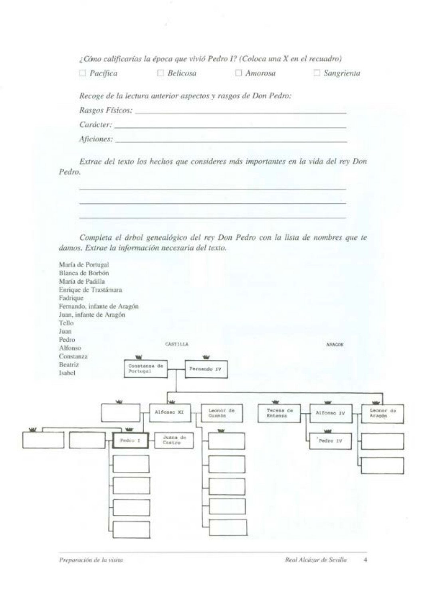

---

# 7. oldal – Történelmi háttér

## Történelmi áttekintés
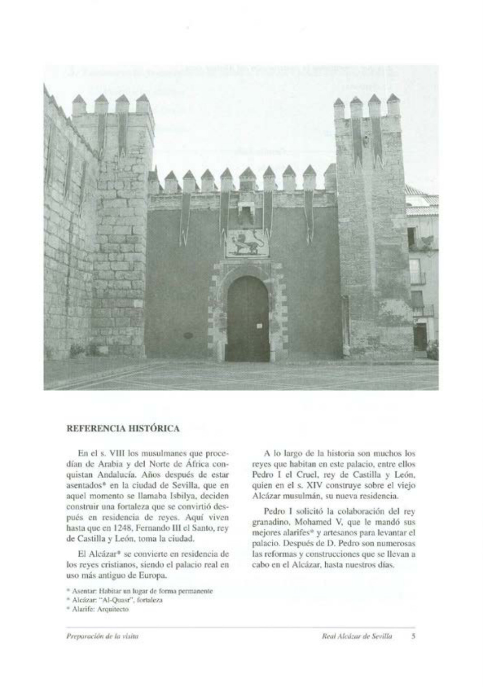

A **8. században** az Arábiából és Észak-Afrikából érkező muszlimok meghódították Andalúziát.

Miután több évig letelepedtek a városban, amelyet akkor **Isbilyának** neveztek, úgy döntöttek, hogy elfoglalják a régi várost, és létrehozzák az Alcázart.

Az Alcázar később a keresztény királyok rezidenciájává vált, és Európa legrégebben folyamatosan használt királyi palotájaként írják le.

A történelem során számos király lakott ebben a palotában. Közéjük tartozott **I. (Kegyetlen) Péter**, Kasztília és León királya, aki a **14. században** a régi muszlim Alcázarra építette új rezidenciáját.

I. Péter a granadai király, **V. Mohamed** segítségét kérte, aki legjobb kőműveseit és kézműveseit küldte el a palota felépítéséhez.

I. Péter után számos átalakítás és építkezés történt az Alcázarban egészen napjainkig.

### Fogalmak

**Letelepedni:** egy helyen tartósan megtelepedni, ott élni.

**Alcázar:** az arab *al-qasr* szóból; erődített palota, erőd.

**Alarife:** építész, illetve építőmester.

---

# 8. oldal – Feladatok a történelmi háttérhez

### Kik kezdték meg az Alcázar építését?

- [ ] Keresztények
- [ ] Muszlimok

### I. Péter melyik királyság királya volt?

- [ ] Granada
- [ ] Kasztília–León
- [ ] Navarra
- [ ] Aragónia

### Írd le annak a királynak a nevét és vallását, aki segített I. Péternek az Alcázar építésében!

**Név:** ............................................................

**Vallás:** ............................................................

### Történelmi térkép

Az eredeti kiadvány térképe azt mutatja be, hogy az Ibériai-félsziget milyen királyságokra oszlott ebben a korszakban.

**Feladat:** egészítsd ki a térképet a hiányzó királyságok nevével.

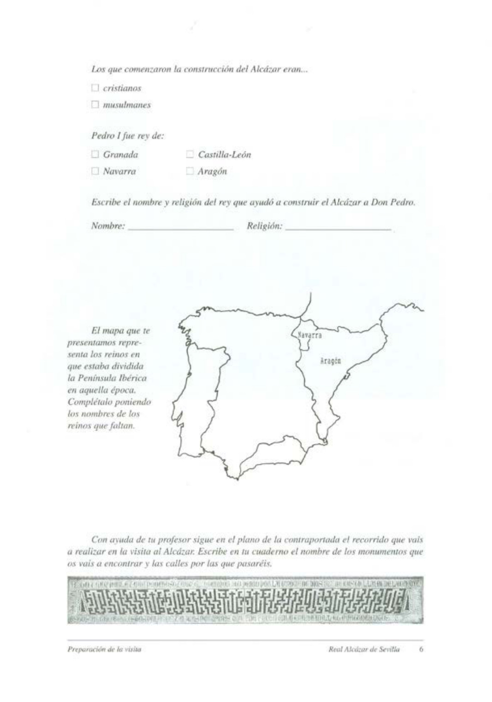

### A látogatás útvonala

Tanárod segítségével kövesd a hátsó borító térképén azt az útvonalat, amelyet az Alcázar látogatása során bejártok.

Írd be a füzetedbe:

1. a meglátogatott műemlékek nevét;
2. azokat az utcákat, amelyeken elhaladtok.

---

# 9. oldal – Az Alcázarhoz vezető út

## Az Alcázar felé

Az útvonalon haladva kövesd a hátsó borító térképét.

Figyeld meg és jegyezd fel, hogy hány oldala van az egyes tornyoknak, amelyek mellett elhaladtok.

| Torony | Oldalak száma |
|---|---|
| Torre del Oro – Aranytorony | ........ |
| Torre de la Plata – Ezüsttorony | ........ |
| Torre de Abd el-Aziz | ........ |
| Oroszlánkapu tornyai | ........ |

### A falak

Figyeld meg a falat, amely a Plaza del Triunfótól, az Oroszlánkapu mellett elhaladva, a Patio de la Monteríáig húzódik.

**Milyen anyagból épült?**

- [ ] Kő
- [ ] Tégla
- [ ] Gipsz

### I. Péter palotájának kapuja

Állj szembe I. Péter király palotájának kapujával.

**Milyen anyagokat használtak az építésénél?**

- [ ] Kő
- [ ] Tégla
- [ ] Beton
- [ ] Csempedíszítés
- [ ] Gipsz
- [ ] Fa
- [ ] Fém
- [ ] Márvány

Ezért gondolj arra, milyen sokféle kézműves vehetett részt az építkezésben.

Tudjuk, hogy közülük sokan Kasztília más városaiból, például **Córdobából és Toledóból**, sőt egy másik királyságból is érkeztek.

**Melyikből?**

- [ ] Aragónia
- [ ] Granada
- [ ] Navarra

*Ha nem emlékszel, keresd meg a választ az 5. oldalon.*

### A bejárat

Belépéskor egy fallal találkozunk közvetlenül magunk előtt, ezért balra vagy jobbra kell fordulnunk.

**Melyik irányt választanád?**

............................................................

**Miért?**

............................................................

A kutatók szerint ez a fajta bejárat két okra vezethető vissza:

- megnehezítette a bejutást, zavart keltve egy esetleges támadóban;
- megőrizte az otthon intimitását, követve az arab hagyományt.

---

# 10. oldal – A Patio de las Doncellas

> „A házad belseje szentély; akik megsértik, amikor megszólítanak, miközben te benne vagy, tiszteletlenséget követnek el az Ég tolmácsával szemben. Meg kell várniuk, amíg kijössz onnan. A tisztesség ezt kívánja.”
>
> **Korán, 49. szúra**

## 1. A Patio de las Doncellas

Az előcsarnokból a **Patio de las Doncellas** udvarába jutunk, amely I. Péter király palotájának központja, és amely körül a különböző helyiségek elrendeződnek.

Megfigyelhetted, hogy a falak alsó részeit **csempedíszítés** borítja.

### Mi lehetett ennek a funkciója?

- [ ] Díszítő
- [ ] Higiéniai
- [ ] Szigetelő
- [ ] Fűtési

Alapvetően kétféle kerámia-burkolatot különböztethetünk meg:

- **azulejería:** közepes méretű, négyzet alakú, azonos elemekből készül;
- **alicatado:** különböző alakú és kis méretű darabokból készül, amelyekből változatos kompozíciókat alakítanak ki.

### Megfigyelési feladat

Keresd meg az udvarban a fényképen látható csempekompozíciót. Találd meg rajta a rajzokon szereplő elemeket, és írd melléjük, milyen színű mázzal vannak bevonva.

**Színek:**

1. ................................
2. ................................

*[Az eredeti fényképes feladat helye]*

---

# 11. oldal – Az udvar díszítése

Az udvart a földszinten ívekkel kialakított galéria veszi körül.

### Milyenek ezek az ívek?

- [ ] Félköríves
- [ ] Karéjos
- [ ] Csúcsíves

Figyeld meg, hogy az ívek között és az oszlopok fölött olyan kezek láthatók, amelyek ágakat, gyümölcsöket és állatokat tartanak.

Ez **Fátima kezének** ábrázolása. Fátima Mohamed lánya volt, keze pedig a muszlimok számára a szerencse amulettje.

Az udvar a **földi paradicsomot** jelképezte: az oszlopok a fák törzsei, az árkádok pedig az ágak lennének.

Ezt az udvart I. Péter idején építették, majd **V. Károly császár és Portugáliai Izabella** esküvője alkalmából átalakították.

Figyeld meg, hogy az árkádsor fölött egy gipszből készült, címerekkel díszített fríz fut végig.

A **oroszlánt, várat és sávot** ábrázoló címerek I. Péter uralkodásához kapcsolódnak.

A **kétfejű sas** és a „**plus ultra**” feliratot viselő oszlopok V. Károly jelképei.

### Feladat

Keress az udvar egy másik részén is egy ilyen címert.

**Hely:** ............................................................

**Ábrázolt motívum:** ................................................

### A felső szint ívei

Figyeld meg a felső szint íveit.

**Ugyanolyanok, mint a földszinten?**

- [ ] Igen
- [ ] Nem

**Milyen típusúak?**

- [ ] Félköríves
- [ ] Karéjos
- [ ] Csúcsíves

### Milyen a Patio teteje?

- [ ] Cserép
- [ ] Azulejo / mázas cserép
- [ ] Pala

---

# 12. oldal – A palota alaprajza

## I. Péter palotájának alaprajza

Az eredeti alaprajz főbb helyiségei:

1. **Patio de las Doncellas**
2. **V. Károly mennyezetes terme**
3. **Az infánsok hálószobája**
4. **Trónterem / Követek terme**
5. **Patio de las Muñecas**
6. **A királyné hálószobája**
7. **A király lakosztályai**

*[Az eredeti alaprajz helye]*

Ahogy végighaladunk a különböző termeken, rajzold be az útvonalat az alaprajzra.

### 2. V. Károly terme

A következő helyiségbe, **V. Károly termébe** lépünk. A 16. században ez volt a palota kápolnája; itt tartották a császár, V. Károly és Portugáliai Izabella esküvőjét.

**Milyen, V. Károlyhoz kapcsolódó jelképek jelennek meg a mennyezeten?**

....................................................................

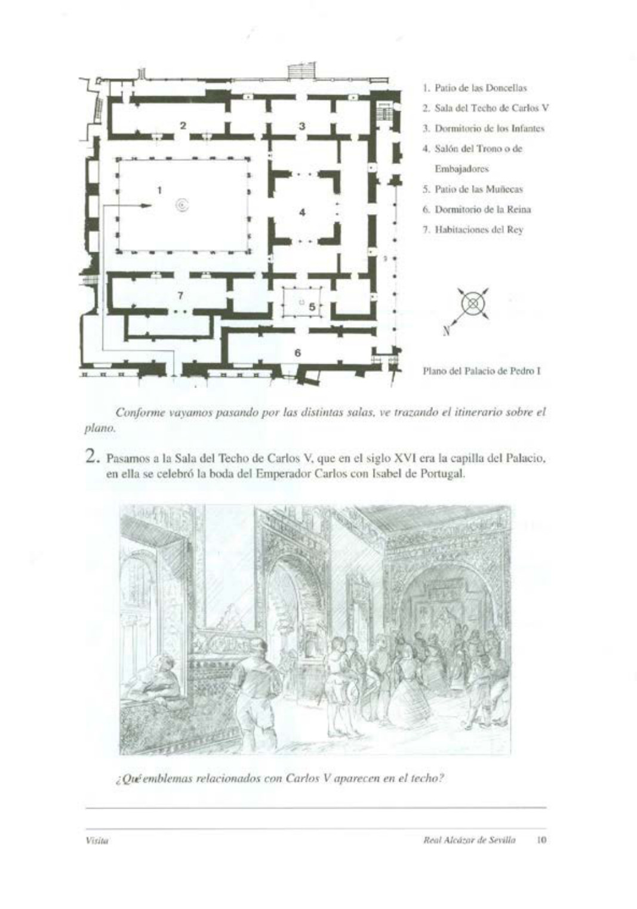

---

# 13. oldal – Az infánsok hálószobái

## 3. Az infánsok hálószobái

Figyeld meg és jelöld meg jellemzőiket:

- [ ] A kertekre nyílnak
- [ ] Délkelet felé tájoltak
- [ ] Belső helyiségek
- [ ] Egyéb: ....................................................

### Szerinted alkalmasak ezek a helyiségek gyermekek hálószobájának?

- [ ] Igen
- [ ] Nem

**Miért?**

....................................................................

....................................................................

A trónterem két oldalán két előszoba található. Frízeiket **háborús és udvari jelenetek** díszítik.

Néhány ilyen jelenet alapul szolgálhat egy történet elmeséléséhez.

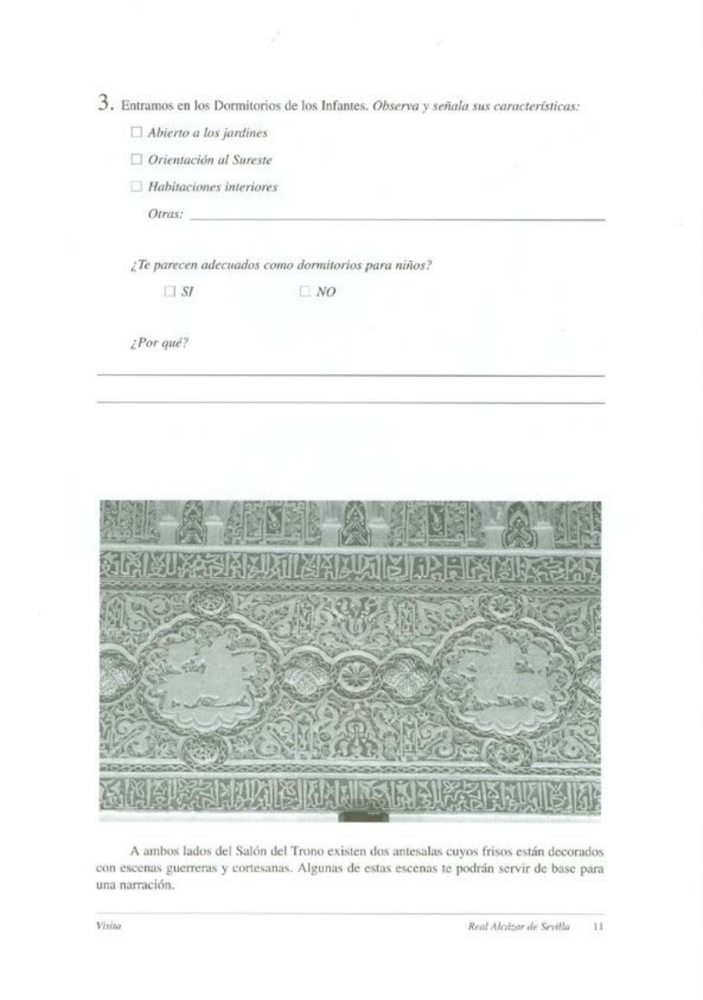

---

# 14. oldal – A Trónterem / Követek terme

## 4. A Trónterem vagy Követek terme

A terem hivatalos fogadások helyszínéül szolgált.

### A terem mennyezetének alakja

- [ ] Kocka
- [ ] Piramis
- [ ] Félgömb

### Az alaprajza

- [ ] Négyzet
- [ ] Téglalap
- [ ] Háromszög

Amint látod, a mennyezetet csillagok díszítik, mivel az **égboltot** jelképezi.

A középkorban úgy hitték, hogy a Föld lapos, ezért négyzetként ábrázolták.

Így a terem egésze az **univerzumot – az eget és a földet –** jelképezi.

A trónon ülő király az univerzum urának érezhette magát.

Ez a terem, akárcsak az egész palota, gazdagságával és pompájával nyűgöz le. Ezt értékes anyagok – például márvány és arany – használatával, valamint közönségesebb anyagok nemesítésével érték el.

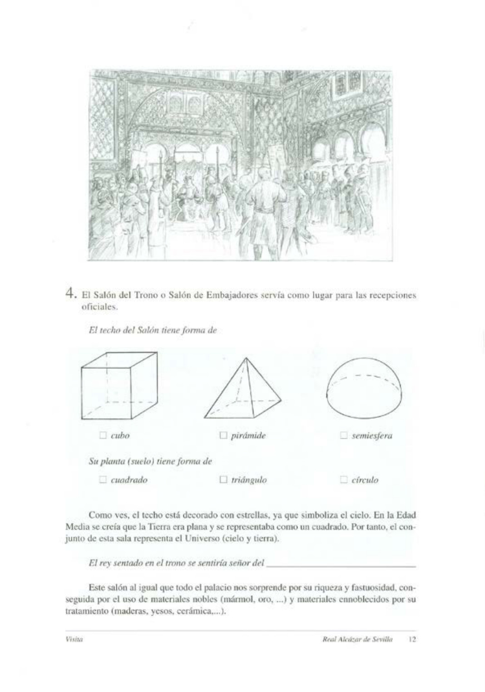

---

# 15. oldal – A Követek termének rétegei

A **Követek terme** az Alcázar többi részéhez hasonlóan a történelem során több átalakításon ment keresztül.

Az eredeti ábra az alábbi különböző korszakokból származó elemeket jelöli:

- **Hölgyek portréi** – 16. század
- **Spanyolország királyainak fríze** – 15–16. század
- **Erkélyek** – 16. század
- **Gipszdíszítések** – 14. század
- **Csempedíszítés** – 14. század

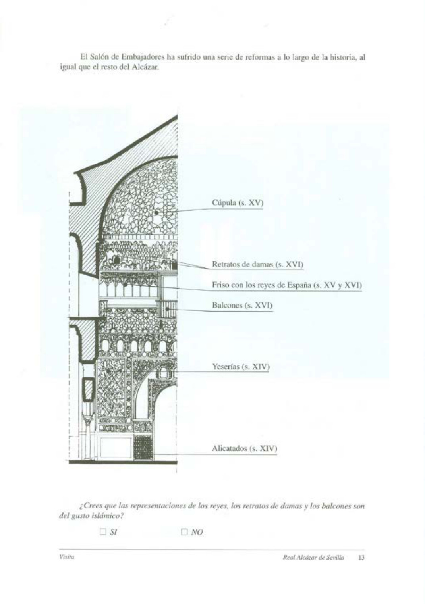

### Feladat

Szerinted a királyok ábrázolása, a hölgyek portréi és az erkélyek az **iszlám ízlésnek** felelnek meg?

- [ ] Igen
- [ ] Nem

---

# 16. oldal – A Patio de las Muñecas és a királyné hálószobája

## 5. A Patio de las Muñecas

A **Patio de las Muñecas** a palota magánterületének központja. Ezért bensőségesebb jellegű, és egyes elemei különösen finom kidolgozásúak.

Figyeld meg az oszlopokat és oszlopfőket: ezek **újrahasznosított anyagok**, amelyek régebbi épületekből származnak.

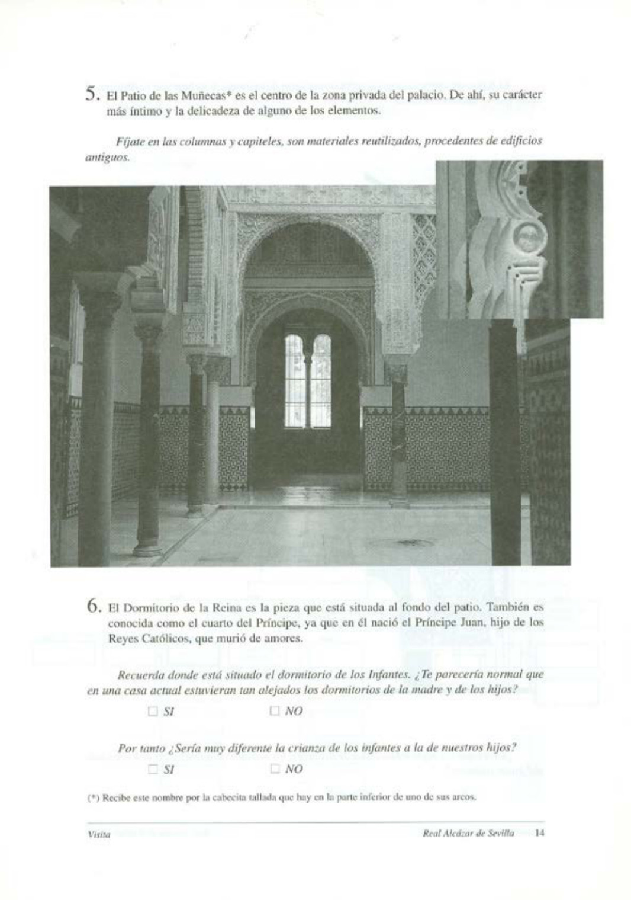

## 6. A királyné hálószobája

A királyné hálószobája az udvar végében található helyiség.

**Hercegi szobának** is nevezik, mert itt született **Juan herceg**, a katolikus királyok fia, aki fiatalon, szerelmi bánatban halt meg.

Emlékezz vissza, hol helyezkedik el az infánsok hálószobája.

### Normálisnak tűnne-e egy mai házban, hogy az anya és gyermekei hálószobái ennyire távol legyenek egymástól?

- [ ] Igen
- [ ] Nem

### Ezért nagyon különbözött-e az infánsok nevelése a mai gyermekeink nevelésétől?

- [ ] Igen
- [ ] Nem

**Megjegyzés:** A „Muñecas” elnevezés az egyik ív alsó részén található, faragott kis fejre utal.

---

# 17. oldal – A király magánlakosztálya

## 7. A király magánterülete

A király magánterülete a következő helyiségekből állt:

- egy előszoba;
- a királyi kamara / dolgozószoba;
- a hálószoba.

Az Alcázar – ahogyan Sevilla hagyományos palotaházaiban is szokásos volt – **nyári és téli lakrésszel** rendelkezett.

### Ezek a helyiségek melyik évszakban használt területhez tartozhattak?

- [ ] Nyár
- [ ] Tél

Az **gipszdíszítések, csempedíszítések, padlóburkolatok és mennyezetek együttese** az egész palota legjobban megőrzött része.

Annak érdekében, hogy ez az állapot fennmaradjon, miközben az épület kulturális örökségként látogatható és továbbra is királyi rezidenciaként használható, a királyi család szobái jelenleg a **felső emeleten** találhatók.

---

# 18. oldal – A nyolc hibás játék

## A 8 hiba játéka

Az alábbi rajzok első pillantásra egyformának tűnnek, de ha alaposan megnézed őket, különbségeket találsz.

**Feladat:** jelöld meg a jobb oldali rajzokon az elkövetett hibákat.

**Rajzonként 2 eltérés található.**

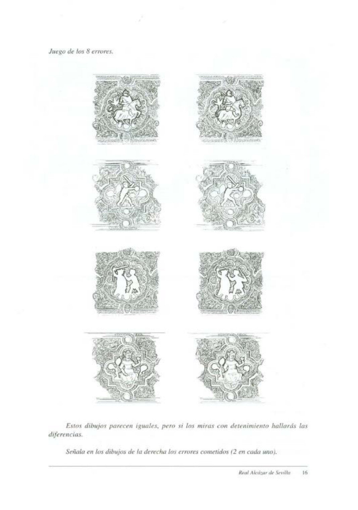

---

# 19. oldal – Képes oldal

---

# 20. oldal – Helyszínrajz

## Helyszínrajz

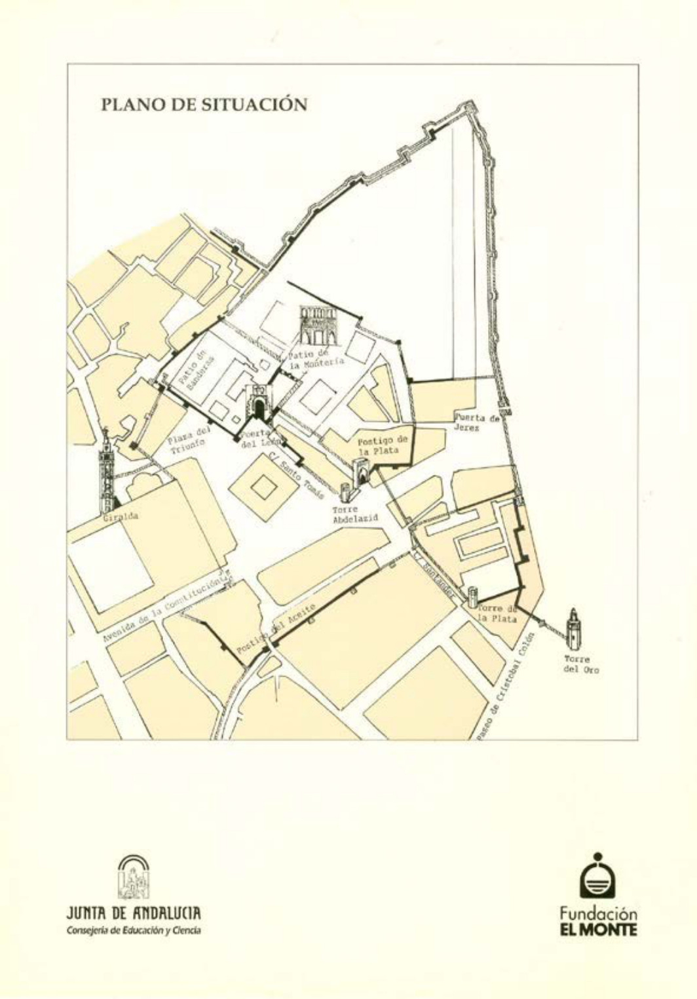

---

# Fogalom- és névjegyzék

## Fontos történelmi személyek

- **I. Péter (Kegyetlen Péter):** Kasztília és León királya; a 14. században az Alcázar régi muszlim épületére építtette mudejár palotáját.
- **María de Padilla:** I. Péter kedvelt társa, akit a király később titkos feleségeként ismert el.
- **Bourbon Blanka:** I. Péter felesége, Franciaországból származó hercegnő.
- **Trastámarai Henrik:** I. Péter ellenfele, aki később Kasztília királya lett.
- **V. Mohamed:** Granada királya, aki kézműveseket és építőmestereket küldött I. Péter palotájának építéséhez.
- **V. Károly:** német-római császár és spanyol király; Portugáliai Izabellával kötött házasságához kapcsolódóan az Alcázar több részét átalakították.

## Fontos helyek és építészeti elemek

- **Patio de las Doncellas:** a palota főudvara.
- **Patio de las Muñecas:** a palota magánterületének központi udvara.
- **Követek terme / Trónterem:** a hivatalos fogadások helyszíne.
- **Oroszlánkapu:** az Alcázar egyik fontos bejárata.
- **Torre del Oro:** Aranytorony.
- **Torre de la Plata:** Ezüsttorony.
- **Alcázar:** erődített királyi palota.
- **Mudejár:** olyan középkori ibériai művészeti és építészeti hagyomány, amelyben a muszlim művészet és technikák keresztény környezetben is tovább éltek.

---

## A munkafüzet célja

A kiadvány célja, hogy a sevillai Real Alcázar látogatását történelmi és művészettörténeti megfigyelésekkel kapcsolja össze. A feladatok az épület történetére, I. Péter uralkodására, az iszlám és keresztény művészeti hagyományokra, valamint az Alcázar építészeti részleteinek megfigyelésére irányulnak.

